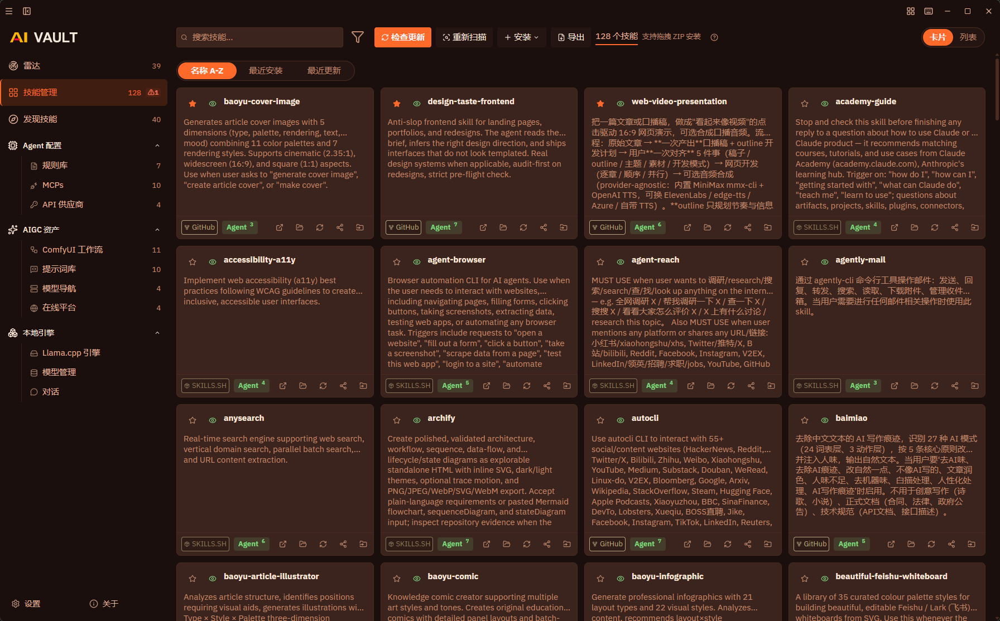
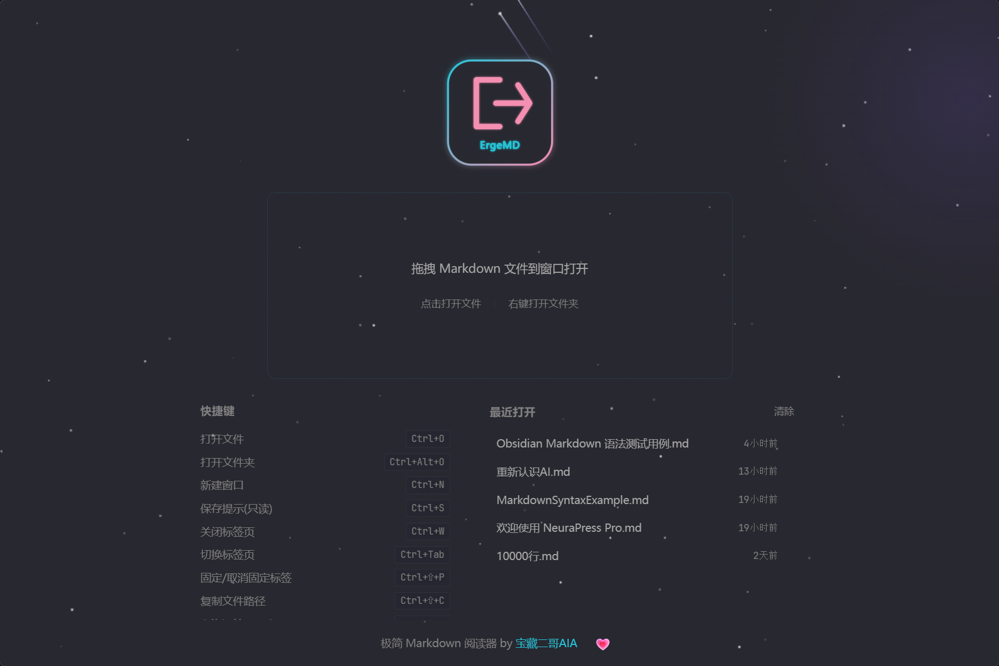

# updates-dist

> 宝藏二哥AIA 软件作品的**更新分发仓**与**产品橱窗**：自动更新清单、内置资产与安装包从这里发布；各产品在此一览名称、界面、功能与下载入口。

**个人网站**：[https://ergeaia.github.io/](https://ergeaia.github.io/) · 「AI 时代的普通人之友」

---

## 产品一览

| 产品 | 一句话 | 获取 | 下载量 |
|------|--------|------|--------|
| [**AI Vault**](#ai-vault) | 本地优先的 AI 创作者工作台：Skill / Prompt / MCP / 工作流 / 模型统一管理，分发到 46+ Agent | [本仓下载](#ai-vault) · [官网 / 文档](https://ergeaia.github.io/aivault-site/) |  |
| [**ErgeMD**](#ergemd) | 专注 Markdown 阅读的桌面应用：极致渲染 + 丝滑阅读 + Mermaid 兼容 | [仓库](https://github.com/ErgeAIA/ErgeMD) |  |
| [**ErgeHash**](#ergehash) | 跨平台文件哈希校验：本地优先、零上传、批量极速 | [仓库 / 下载](https://github.com/ErgeAIA/ErgeHash) |  |
| [**Catapult-CN**](#catapult-cn) | llama.cpp 桌面启动器（汉化分支，已停更）→ 继任者 [AI Vault](#ai-vault) | [仓库](https://github.com/ErgeAIA/catapult-cn) |  |

---

## AI Vault

> 本地优先、Agent-centric 的 AI 创作者工作台：统一管理 Skill / Prompt / MCP / ComfyUI 工作流 / 模型 / 在线平台 / API 供应商，并向各 Agent 的 skills 目录分发。

**功能要点**

- 本地优先：数据存本机 SQLite，无账号、无云端上传
- 一键分发：技能主副本 SSOT，symlink 同步到 46+ Agent 配置目录
- 资产全家桶：技能 / 提示词 / MCP / ComfyUI 工作流 / 模型 / API 供应商 / 规则库
- 本地推理：内置 llama.cpp 引擎托管，参数手册与显存预设
- 密钥安全：API Key 以 AES-256-GCM 加密落盘
- 双语界面：简体中文 / English

**最新版本**：v0.2.6

| 平台 | 安装包 |
|------|--------|
| Windows x64 | [AI-Vault_0.2.6_x64-setup.exe](https://github.com/ErgeAIA/updates-dist/releases/download/aivault-v0.2.6/AI-Vault_0.2.6_x64-setup.exe) |
| macOS Apple Silicon | [AI-Vault_0.2.6_aarch64.app.tar.gz](https://github.com/ErgeAIA/updates-dist/releases/download/aivault-v0.2.6/AI-Vault_0.2.6_aarch64.app.tar.gz) |
| macOS Intel | [AI-Vault_0.2.6_x86_64.app.tar.gz](https://github.com/ErgeAIA/updates-dist/releases/download/aivault-v0.2.6/AI-Vault_0.2.6_x86_64.app.tar.gz) |

> **macOS 平台说明**：未启用 Apple 代码签名（免费软件策略），首次打开请 **右键 → 打开** 绕过 Gatekeeper。

**软件自动更新**：客户端启动时静默检查 `aivault/updates.json`，发现新版本后侧边栏显示更新徽章，一键下载安装并重启。

- 官网 / 文档：[ergeaia.github.io/aivault-site](https://ergeaia.github.io/aivault-site/) · [使用文档](https://ergeaia.github.io/aivault-site/docs/)

---

## ErgeMD

> 专注 Markdown 阅读的桌面应用：**极致的渲染美感 + 丝滑的阅读体验**，对 Mermaid 等图表友好。

**功能要点**

- Markdown 渲染：GFM、KaTeX 公式、代码高亮、Mermaid / PlantUML、任务列表
- 阅读体验：虚拟滚动、进度追踪、多种主题、自动浮动章节
- Obsidian 兼容：Callout、Wiki 链接、嵌入引用、高亮与块 ID 等
- 工作区：多标签、文件树、书签；一键打开原文件位置
- 导出：HTML / Word / Mermaid 图 SVG

**获取安装包与更新说明** → 源仓库 **[github.com/ErgeAIA/ErgeMD](https://github.com/ErgeAIA/ErgeMD)**（本仓亦提供 `ergemd/updates.json` 自动更新清单，安装包与完整文档以源仓库为准）

---

## ErgeHash

> 轻量、**跨平台**的桌面**文件哈希校验**工具：本地优先、零上传、极速批量、结果清晰可溯。

**功能要点**

- 多算法：SHA-256 / SHA-1 / MD5 / CRC32 等，可一次算多个
- 批量与拖放：多文件、文件夹递归；拖入即算；单趟读取避免重复 IO
- 校验文件比对：导入 `.md5` / `.sfv` / `.sha256` 等自动比对
- 结果可溯：树形列表展示算法 / 哈希 / 耗时，可复制、导出 CSV
- 跨平台：Tauri 2，Windows 与 macOS（Apple Silicon）

**下载与文档** → **[github.com/ErgeAIA/ErgeHash](https://github.com/ErgeAIA/ErgeHash)**（Releases 提供安装包）

---

## Catapult-CN

> [llama.cpp](https://github.com/ggml-org/llama.cpp) 的桌面启动器（中文汉化分支）：管理运行时、发现/下载模型、配置服务器参数、内置聊天——无需命令行。

**说明**

- 汉化与增强：中文界面、ModelScope 下载、打开模型目录等
- **本项目已停止维护**；功能更完整的继任者是 [**AI Vault**](#ai-vault)（本地引擎 + 资产管理）
- Windows 为主；参数说明见源仓库文档

**仓库** → **[github.com/ErgeAIA/catapult-cn](https://github.com/ErgeAIA/catapult-cn)**（请优先改用 AI Vault）

---

## 分发说明

| 约定 | 说明 |
|------|------|
| 自动更新清单 | `aivault/updates.json`、`aivault/updates-gitee.json`、`ergemd/updates.json` |
| 内置资产 | `aivault/builtin/`（per-type 日期版本 + `index.json`） |
| 安装包 | 只挂在 [Releases](https://github.com/ErgeAIA/updates-dist/releases)，不进 git 文件树 |
| 路径红线 | 禁止出现 `aivault/aivault/` 冗余路径；发版后可跑 `scripts/verify-dist-layout.sh` |
| 双源 | GitHub raw 为默认；Gitee 为镜像（国内网络） |
| 版本同步 | 发版 CI 同步 README「最新版本」与下载链接（见 AGENTS.md 工作流） |

---

## 作者信息

<table>
<tr>
<td align="center" valign="middle" width="220">
 
<b>宝藏二哥AIA / ErgeAIA</b> 
生命不息，折腾不止
</td>
<td valign="middle" style="padding-left: 18px;">

**个人网站**：[ergeaia.github.io](https://ergeaia.github.io/) — 产品导航与作品集

**关于我**：独立开发者 / 全栈工程师 / ComfyUI 爱好者 / Vibe Coding 实践者 
**技术栈**：Tauri · Rust · React · Python · Claude · ZCode · Workbuddy 
**理念**：三无分享 — 无门槛、无套路、无保留

**链接**：
📺 [B 站](https://space.bilibili.com/67221461) · [知乎](https://www.zhihu.com/people/meli55a/posts) · 微信公众号(ErgeAIA) 
🐙 [GitHub](https://github.com/ErgeAIA) · [Gitee](https://gitee.com/ErgeAIA) 
📦 作品：[AI Vault](https://ergeaia.github.io/aivault-site/) · [ErgeMD](https://github.com/ErgeAIA/ErgeMD) · [ErgeHash](https://github.com/ErgeAIA/ErgeHash) · [Catapult-CN](https://github.com/ErgeAIA/catapult-cn)

</td>
</tr>
</table>

---

如果这些工具帮到了你，欢迎点个 ⭐ 鼓励一下，并到 [个人网站](https://ergeaia.github.io/) 看看全部作品。

用 ❤️ 和 Tauri 制作

